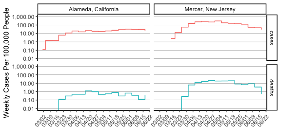

COVID-19 Data from NYT for Counties of Interest
================

Updated: Wed May 20 20:27:39 2020

Get the Data
------------

The NYT is super generous with their data. Go get it.

``` r
library(tidyverse)
library(magrittr)
curl::curl_download(
  url      = 'https://github.com/nytimes/covid-19-data/raw/master/us-counties.csv',
  destfile = './county-cases.csv'
)
df <- read_csv('county-cases.csv') 
```

Are you curious what it looks like? It looks like this.

``` r
df %>%
  sample_n(15) %>%
  pander::pandoc.table(caption = 'NYT COVID Tracking Data')
```

<table style="width:94%;">
<caption>NYT COVID Tracking Data</caption>
<colgroup>
<col width="18%" />
<col width="19%" />
<col width="23%" />
<col width="11%" />
<col width="11%" />
<col width="11%" />
</colgroup>
<thead>
<tr class="header">
<th align="center">date</th>
<th align="center">county</th>
<th align="center">state</th>
<th align="center">fips</th>
<th align="center">cases</th>
<th align="center">deaths</th>
</tr>
</thead>
<tbody>
<tr class="odd">
<td align="center">2020-04-02</td>
<td align="center">Calhoun</td>
<td align="center">South Carolina</td>
<td align="center">45017</td>
<td align="center">3</td>
<td align="center">1</td>
</tr>
<tr class="even">
<td align="center">2020-05-13</td>
<td align="center">Scioto</td>
<td align="center">Ohio</td>
<td align="center">39145</td>
<td align="center">13</td>
<td align="center">0</td>
</tr>
<tr class="odd">
<td align="center">2020-03-01</td>
<td align="center">Los Angeles</td>
<td align="center">California</td>
<td align="center">06037</td>
<td align="center">1</td>
<td align="center">0</td>
</tr>
<tr class="even">
<td align="center">2020-05-19</td>
<td align="center">Ector</td>
<td align="center">Texas</td>
<td align="center">48135</td>
<td align="center">127</td>
<td align="center">4</td>
</tr>
<tr class="odd">
<td align="center">2020-05-08</td>
<td align="center">Gove</td>
<td align="center">Kansas</td>
<td align="center">20063</td>
<td align="center">1</td>
<td align="center">0</td>
</tr>
<tr class="even">
<td align="center">2020-05-08</td>
<td align="center">Schuylkill</td>
<td align="center">Pennsylvania</td>
<td align="center">42107</td>
<td align="center">430</td>
<td align="center">13</td>
</tr>
<tr class="odd">
<td align="center">2020-05-12</td>
<td align="center">Hall</td>
<td align="center">Nebraska</td>
<td align="center">31079</td>
<td align="center">1344</td>
<td align="center">35</td>
</tr>
<tr class="even">
<td align="center">2020-04-15</td>
<td align="center">Concordia</td>
<td align="center">Louisiana</td>
<td align="center">22029</td>
<td align="center">21</td>
<td align="center">1</td>
</tr>
<tr class="odd">
<td align="center">2020-03-30</td>
<td align="center">Pueblo</td>
<td align="center">Colorado</td>
<td align="center">08101</td>
<td align="center">21</td>
<td align="center">2</td>
</tr>
<tr class="even">
<td align="center">2020-04-18</td>
<td align="center">Bexar</td>
<td align="center">Texas</td>
<td align="center">48029</td>
<td align="center">1003</td>
<td align="center">38</td>
</tr>
<tr class="odd">
<td align="center">2020-05-16</td>
<td align="center">Idaho</td>
<td align="center">Idaho</td>
<td align="center">16049</td>
<td align="center">3</td>
<td align="center">0</td>
</tr>
<tr class="even">
<td align="center">2020-05-16</td>
<td align="center">Freeborn</td>
<td align="center">Minnesota</td>
<td align="center">27047</td>
<td align="center">61</td>
<td align="center">0</td>
</tr>
<tr class="odd">
<td align="center">2020-04-28</td>
<td align="center">Sonoma</td>
<td align="center">California</td>
<td align="center">06097</td>
<td align="center">228</td>
<td align="center">2</td>
</tr>
<tr class="even">
<td align="center">2020-05-15</td>
<td align="center">De Witt</td>
<td align="center">Illinois</td>
<td align="center">17039</td>
<td align="center">4</td>
<td align="center">0</td>
</tr>
<tr class="odd">
<td align="center">2020-04-15</td>
<td align="center">Pike</td>
<td align="center">Alabama</td>
<td align="center">01109</td>
<td align="center">27</td>
<td align="center">0</td>
</tr>
</tbody>
</table>

Tidy the data
-------------

Tidy the data by filtering on the counties of interest, and gathering values of interest into a single column.

``` r
county_list = c(
  'Alameda, California', 
  #'Contra Costa, California', 
  #'Bernalillo, New Mexico', 
  #'Mecklenburg, North Carolina',
  'Mercer, New Jersey'
)
df %<>%
  # filter on the county_list
  mutate(county = paste(county, state, sep = ', ')) %>%
  filter(county %in% county_list) %>% 
  # we don't need everything, keep only the region, day, and counts
  select(county, date, cases, deaths) %>%
  # tidy the data by putting all observations in rows
  gather(key = type, value = number, -date, -county) %>%
  # group by county and type (deaths or cases) to get a delta column for new cases in a day
  group_by(county, type) %>%
  arrange(date) %>%
  mutate(new = number - lag(number, default = 0)) %>%
  ungroup()
```

Curious what it looks like now? It looks like this.

``` r
df %>%
  arrange(date) %>%
  sample_n(15) %>%
  pander::pandoc.table(caption = 'Tracking Data Ready for Plotting')
```

<table style="width:81%;">
<caption>Tracking Data Ready for Plotting</caption>
<colgroup>
<col width="30%" />
<col width="18%" />
<col width="12%" />
<col width="12%" />
<col width="6%" />
</colgroup>
<thead>
<tr class="header">
<th align="center">county</th>
<th align="center">date</th>
<th align="center">type</th>
<th align="center">number</th>
<th align="center">new</th>
</tr>
</thead>
<tbody>
<tr class="odd">
<td align="center">Mercer, New Jersey</td>
<td align="center">2020-05-18</td>
<td align="center">deaths</td>
<td align="center">408</td>
<td align="center">1</td>
</tr>
<tr class="even">
<td align="center">Alameda, California</td>
<td align="center">2020-04-08</td>
<td align="center">deaths</td>
<td align="center">16</td>
<td align="center">1</td>
</tr>
<tr class="odd">
<td align="center">Alameda, California</td>
<td align="center">2020-05-07</td>
<td align="center">cases</td>
<td align="center">1938</td>
<td align="center">54</td>
</tr>
<tr class="even">
<td align="center">Alameda, California</td>
<td align="center">2020-04-20</td>
<td align="center">cases</td>
<td align="center">1212</td>
<td align="center">27</td>
</tr>
<tr class="odd">
<td align="center">Alameda, California</td>
<td align="center">2020-05-05</td>
<td align="center">deaths</td>
<td align="center">66</td>
<td align="center">1</td>
</tr>
<tr class="even">
<td align="center">Alameda, California</td>
<td align="center">2020-05-06</td>
<td align="center">deaths</td>
<td align="center">69</td>
<td align="center">3</td>
</tr>
<tr class="odd">
<td align="center">Alameda, California</td>
<td align="center">2020-04-27</td>
<td align="center">deaths</td>
<td align="center">56</td>
<td align="center">4</td>
</tr>
<tr class="even">
<td align="center">Alameda, California</td>
<td align="center">2020-05-01</td>
<td align="center">cases</td>
<td align="center">1657</td>
<td align="center">33</td>
</tr>
<tr class="odd">
<td align="center">Alameda, California</td>
<td align="center">2020-03-18</td>
<td align="center">deaths</td>
<td align="center">0</td>
<td align="center">0</td>
</tr>
<tr class="even">
<td align="center">Alameda, California</td>
<td align="center">2020-04-02</td>
<td align="center">deaths</td>
<td align="center">9</td>
<td align="center">1</td>
</tr>
<tr class="odd">
<td align="center">Mercer, New Jersey</td>
<td align="center">2020-04-20</td>
<td align="center">cases</td>
<td align="center">2591</td>
<td align="center">196</td>
</tr>
<tr class="even">
<td align="center">Mercer, New Jersey</td>
<td align="center">2020-03-20</td>
<td align="center">cases</td>
<td align="center">22</td>
<td align="center">2</td>
</tr>
<tr class="odd">
<td align="center">Alameda, California</td>
<td align="center">2020-05-02</td>
<td align="center">deaths</td>
<td align="center">63</td>
<td align="center">0</td>
</tr>
<tr class="even">
<td align="center">Mercer, New Jersey</td>
<td align="center">2020-05-17</td>
<td align="center">deaths</td>
<td align="center">407</td>
<td align="center">11</td>
</tr>
<tr class="odd">
<td align="center">Mercer, New Jersey</td>
<td align="center">2020-03-26</td>
<td align="center">cases</td>
<td align="center">111</td>
<td align="center">29</td>
</tr>
</tbody>
</table>

Plot the data
-------------

This is what the straight-up cumulative data looks like.

``` r
# time for plotting
library(ggplot2)
ggplot(df, aes(x = date, y = number, fill = type)) +
  geom_area(alpha    = 0.5,
            position = 'identity',
            show.legend = FALSE) +
  scale_y_continuous(name   = '',
                     labels = scales::comma) +
  scale_x_date(name        = '',
               date_breaks = '1 week',
               labels      = scales::date_format('%m/%d')) +
  facet_grid(type~county, scales = 'free_y') +
  theme_classic() +
  theme(axis.text.x = element_text(angle = 40, hjust = 1))
```


This looks at the daily increase.

``` r
ggplot(df, aes(x = date, y = new, color = type)) +
  geom_step(show.legend = FALSE) +
  scale_x_date(name        = '',
               date_breaks = '1 week',
               labels      = scales::date_format('%m/%d')) +
  scale_y_continuous(name   = 'Daily Increase') +
  facet_grid(type~county, scales = 'free_y') +
  theme_classic() +
  theme(axis.text.x = element_text(angle = 40, hjust = 1))
```


Because of the noise in the daily data, maybe a weekly increase is a better idea.

``` r
df %>% 
  dplyr::group_by(lubridate::week(date), type, county) %>% 
  dplyr::summarize(new = sum(new), date = min(date)) %>%
  ggplot(aes(x = date, y = new, color = type)) +
  geom_step(show.legend = FALSE) +
  scale_x_date(name        = '',
               date_breaks = '1 week',
               labels      = scales::date_format('%m/%d')) +
  scale_y_continuous(name   = 'Weekly Increase') +
  facet_grid(type~county, scales = 'free_y') +
  theme_classic() +
  theme(axis.text.x = element_text(angle = 40, hjust = 1))
```


