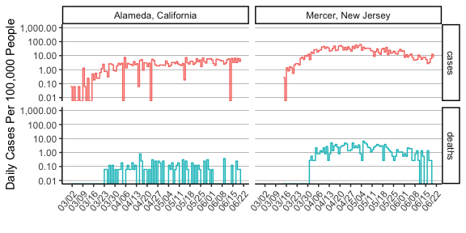

COVID-19 Data from NYT for Counties of Interest
================

Updated: Sun May 24 08:07:11 2020

Get the Data
------------

The NYT is super generous with their data. Go get it.

``` r
library(tidyverse)
library(magrittr)
curl::curl_download(
  url      = 'https://github.com/nytimes/covid-19-data/raw/master/us-counties.csv',
  destfile = './county-cases.csv'
)
df <- read_csv('county-cases.csv') 
```

Are you curious what it looks like? It looks like this.

``` r
df %>%
  sample_n(15) %>%
  pander::pandoc.table(caption = 'NYT COVID Tracking Data')
```

<table style="width:96%;">
<caption>NYT COVID Tracking Data</caption>
<colgroup>
<col width="18%" />
<col width="20%" />
<col width="23%" />
<col width="11%" />
<col width="11%" />
<col width="11%" />
</colgroup>
<thead>
<tr class="header">
<th align="center">date</th>
<th align="center">county</th>
<th align="center">state</th>
<th align="center">fips</th>
<th align="center">cases</th>
<th align="center">deaths</th>
</tr>
</thead>
<tbody>
<tr class="odd">
<td align="center">2020-04-23</td>
<td align="center">Unknown</td>
<td align="center">Rhode Island</td>
<td align="center">NA</td>
<td align="center">1000</td>
<td align="center">169</td>
</tr>
<tr class="even">
<td align="center">2020-05-10</td>
<td align="center">Davie</td>
<td align="center">North Carolina</td>
<td align="center">37059</td>
<td align="center">35</td>
<td align="center">2</td>
</tr>
<tr class="odd">
<td align="center">2020-04-14</td>
<td align="center">Routt</td>
<td align="center">Colorado</td>
<td align="center">08107</td>
<td align="center">41</td>
<td align="center">1</td>
</tr>
<tr class="even">
<td align="center">2020-05-07</td>
<td align="center">Lea</td>
<td align="center">New Mexico</td>
<td align="center">35025</td>
<td align="center">14</td>
<td align="center">0</td>
</tr>
<tr class="odd">
<td align="center">2020-05-06</td>
<td align="center">Deuel</td>
<td align="center">South Dakota</td>
<td align="center">46039</td>
<td align="center">1</td>
<td align="center">0</td>
</tr>
<tr class="even">
<td align="center">2020-03-31</td>
<td align="center">Rutland</td>
<td align="center">Vermont</td>
<td align="center">50021</td>
<td align="center">6</td>
<td align="center">0</td>
</tr>
<tr class="odd">
<td align="center">2020-05-22</td>
<td align="center">Hancock</td>
<td align="center">Georgia</td>
<td align="center">13141</td>
<td align="center">175</td>
<td align="center">17</td>
</tr>
<tr class="even">
<td align="center">2020-03-23</td>
<td align="center">Monroe</td>
<td align="center">Illinois</td>
<td align="center">17133</td>
<td align="center">1</td>
<td align="center">0</td>
</tr>
<tr class="odd">
<td align="center">2020-05-10</td>
<td align="center">La Crosse</td>
<td align="center">Wisconsin</td>
<td align="center">55063</td>
<td align="center">33</td>
<td align="center">0</td>
</tr>
<tr class="even">
<td align="center">2020-03-30</td>
<td align="center">Webster</td>
<td align="center">Iowa</td>
<td align="center">19187</td>
<td align="center">1</td>
<td align="center">0</td>
</tr>
<tr class="odd">
<td align="center">2020-05-22</td>
<td align="center">Ohio</td>
<td align="center">Indiana</td>
<td align="center">18115</td>
<td align="center">13</td>
<td align="center">0</td>
</tr>
<tr class="even">
<td align="center">2020-03-30</td>
<td align="center">Bulloch</td>
<td align="center">Georgia</td>
<td align="center">13031</td>
<td align="center">1</td>
<td align="center">0</td>
</tr>
<tr class="odd">
<td align="center">2020-05-09</td>
<td align="center">Anne Arundel</td>
<td align="center">Maryland</td>
<td align="center">24003</td>
<td align="center">2381</td>
<td align="center">117</td>
</tr>
<tr class="even">
<td align="center">2020-03-26</td>
<td align="center">Woodruff</td>
<td align="center">Arkansas</td>
<td align="center">05147</td>
<td align="center">1</td>
<td align="center">0</td>
</tr>
<tr class="odd">
<td align="center">2020-04-11</td>
<td align="center">Lewis</td>
<td align="center">Tennessee</td>
<td align="center">47101</td>
<td align="center">2</td>
<td align="center">0</td>
</tr>
</tbody>
</table>

Tidy the data
-------------

Tidy the data by filtering on the counties of interest, and gathering values of interest into a single column.

``` r
county_list = c(
  'Alameda, California', 
  #'Contra Costa, California', 
  #'Bernalillo, New Mexico', 
  #'Mecklenburg, North Carolina',
  'Mercer, New Jersey'
)
df %<>%
  # filter on the county_list
  mutate(county = paste(county, state, sep = ', ')) %>%
  filter(county %in% county_list) %>% 
  # we don't need everything, keep only the region, day, and counts
  select(county, date, cases, deaths) %>%
  # tidy the data by putting all observations in rows
  gather(key = type, value = number, -date, -county) %>%
  # group by county and type (deaths or cases) to get a delta column for new cases in a day
  group_by(county, type) %>%
  arrange(date) %>%
  mutate(new = number - lag(number, default = 0)) %>%
  ungroup()
```

Curious what it looks like now? It looks like this.

``` r
df %>%
  arrange(date) %>%
  sample_n(15) %>%
  pander::pandoc.table(caption = 'Tracking Data Ready for Plotting')
```

<table style="width:81%;">
<caption>Tracking Data Ready for Plotting</caption>
<colgroup>
<col width="30%" />
<col width="18%" />
<col width="12%" />
<col width="12%" />
<col width="6%" />
</colgroup>
<thead>
<tr class="header">
<th align="center">county</th>
<th align="center">date</th>
<th align="center">type</th>
<th align="center">number</th>
<th align="center">new</th>
</tr>
</thead>
<tbody>
<tr class="odd">
<td align="center">Mercer, New Jersey</td>
<td align="center">2020-03-25</td>
<td align="center">cases</td>
<td align="center">82</td>
<td align="center">24</td>
</tr>
<tr class="even">
<td align="center">Alameda, California</td>
<td align="center">2020-03-14</td>
<td align="center">cases</td>
<td align="center">29</td>
<td align="center">0</td>
</tr>
<tr class="odd">
<td align="center">Alameda, California</td>
<td align="center">2020-03-28</td>
<td align="center">deaths</td>
<td align="center">6</td>
<td align="center">2</td>
</tr>
<tr class="even">
<td align="center">Alameda, California</td>
<td align="center">2020-05-08</td>
<td align="center">deaths</td>
<td align="center">70</td>
<td align="center">1</td>
</tr>
<tr class="odd">
<td align="center">Mercer, New Jersey</td>
<td align="center">2020-04-15</td>
<td align="center">cases</td>
<td align="center">1856</td>
<td align="center">125</td>
</tr>
<tr class="even">
<td align="center">Mercer, New Jersey</td>
<td align="center">2020-04-13</td>
<td align="center">cases</td>
<td align="center">1646</td>
<td align="center">79</td>
</tr>
<tr class="odd">
<td align="center">Mercer, New Jersey</td>
<td align="center">2020-04-21</td>
<td align="center">deaths</td>
<td align="center">133</td>
<td align="center">11</td>
</tr>
<tr class="even">
<td align="center">Mercer, New Jersey</td>
<td align="center">2020-05-03</td>
<td align="center">cases</td>
<td align="center">4504</td>
<td align="center">233</td>
</tr>
<tr class="odd">
<td align="center">Alameda, California</td>
<td align="center">2020-03-21</td>
<td align="center">cases</td>
<td align="center">87</td>
<td align="center">20</td>
</tr>
<tr class="even">
<td align="center">Alameda, California</td>
<td align="center">2020-03-25</td>
<td align="center">cases</td>
<td align="center">156</td>
<td align="center">5</td>
</tr>
<tr class="odd">
<td align="center">Alameda, California</td>
<td align="center">2020-05-09</td>
<td align="center">cases</td>
<td align="center">2044</td>
<td align="center">62</td>
</tr>
<tr class="even">
<td align="center">Alameda, California</td>
<td align="center">2020-05-03</td>
<td align="center">deaths</td>
<td align="center">63</td>
<td align="center">0</td>
</tr>
<tr class="odd">
<td align="center">Alameda, California</td>
<td align="center">2020-04-25</td>
<td align="center">cases</td>
<td align="center">1458</td>
<td align="center">36</td>
</tr>
<tr class="even">
<td align="center">Mercer, New Jersey</td>
<td align="center">2020-04-16</td>
<td align="center">deaths</td>
<td align="center">87</td>
<td align="center">11</td>
</tr>
<tr class="odd">
<td align="center">Alameda, California</td>
<td align="center">2020-03-05</td>
<td align="center">deaths</td>
<td align="center">0</td>
<td align="center">0</td>
</tr>
</tbody>
</table>

Plot the data
-------------

This is what the straight-up cumulative data looks like.

``` r
# time for plotting
library(ggplot2)
ggplot(df, aes(x = date, y = number, fill = type)) +
  geom_area(alpha    = 0.5,
            position = 'identity',
            show.legend = FALSE) +
  scale_y_continuous(name   = '',
                     labels = scales::comma) +
  scale_x_date(name        = '',
               date_breaks = '1 week',
               labels      = scales::date_format('%m/%d')) +
  facet_grid(type~county, scales = 'free_y') +
  theme_classic() +
  theme(axis.text.x = element_text(angle = 40, hjust = 1))
```


This looks at the daily increase.

``` r
ggplot(df, aes(x = date, y = new, color = type)) +
  geom_step(show.legend = FALSE) +
  scale_x_date(name        = '',
               date_breaks = '1 week',
               labels      = scales::date_format('%m/%d')) +
  scale_y_continuous(name   = 'Daily Increase') +
  facet_grid(type~county, scales = 'free_y') +
  theme_classic() +
  theme(axis.text.x = element_text(angle = 40, hjust = 1))
```



Because of the noise in the daily data, maybe a weekly increase is a better idea.

``` r
df %>% 
  dplyr::group_by(lubridate::week(date), type, county) %>% 
  dplyr::summarize(new = sum(new), date = min(date)) %>%
  ggplot(aes(x = date, y = new, color = type)) +
  geom_step(show.legend = FALSE) +
  scale_x_date(name        = '',
               date_breaks = '1 week',
               labels      = scales::date_format('%m/%d')) +
  scale_y_continuous(name   = 'Weekly Increase') +
  facet_grid(type~county, scales = 'free_y') +
  theme_classic() +
  theme(axis.text.x = element_text(angle = 40, hjust = 1))
```


